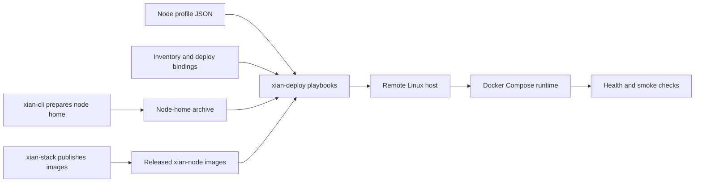

# xian-deploy

`xian-deploy` is the remote deployment layer for Xian nodes on Linux hosts.
It uses Ansible to deploy released `xian-node` images and prepared
node-home archives to remote machines, rather than cloning and building Xian
source on the target.

It pairs with `xian-cli` (which prepares node homes) and with `xian-stack`
(which publishes the runtime images this repo deploys).

## Deployment Flow



## Quick Start

```bash
ansible-playbook playbooks/bootstrap.yml      # prepare host for Docker-based Xian runtime
ansible-playbook playbooks/push-home.yml      # upload a prepared node-home archive
ansible-playbook playbooks/deploy.yml         # start or reconfigure the released node runtime
ansible-playbook playbooks/health.yml         # run remote health checks
```

That flow assumes:

- a node-home archive has already been prepared (typically with `xian-cli`)
- `xian_node_profile` points at the canonical node profile for each host
- inventory and group vars are set for published ports, secrets, and
  `xian_deploy_root` or explicit path overrides
- the target uses released Xian images, not local source builds

## Principles

- **Deploy released artifacts.** No source checkouts on the target host. The
  node runs the same images that `xian-stack` builds and signs.
- **Profile-driven runtime.** The node profile is the source of truth for
  runtime intent: enabled services, block policy, monitoring posture, state
  sync, metrics, P2P peers, snapshots, and node images.
- **Inventory for deploy bindings.** Inventory owns host paths, published
  ports, secrets, resource limits, and the Compose topology. The example
  inventory sets `xian_deploy_root`; derived paths come from role defaults
  unless a private inventory deliberately overrides them. Inventory should not
  duplicate profile runtime settings.
- **Composable flows.** Bootstrap, deploy, upgrade, health, restart, smoke,
  state-sync, and snapshot recovery are separate playbooks. They can be
  invoked in isolation.
- **Optional layers stay optional.** Dashboard, BDS, and monitoring layer on
  top of the core node runtime; nothing in this repo forces them on.
- **Node-home preparation is elsewhere.** `xian-cli` owns generating and
  patching node homes. This repo only ships them and runs them.

## Key Directories

- `playbooks/` — operator entrypoints: `bootstrap.yml`, `push-home.yml`,
  `deploy.yml`, `upgrade.yml`, `health.yml`, `smoke.yml`, `status.yml`,
  `restart.yml`, `stop.yml`, `bootstrap-state-sync.yml`,
  `restore-state-snapshot.yml`.
- `roles/` — reusable deployment roles:
  - `docker_host/` — host bootstrap (Docker, sysctl, base packages).
  - `xian_profile/` — node-profile loading and deploy fact derivation.
  - `xian_node_home/` — node-home upload, layout, and permission rules.
  - `xian_runtime/` — Compose rendering and runtime lifecycle.
- `inventories/` — example inventory layout and shared group variables.
- `collections/` — vendored Ansible collections used by the playbooks.
- `docs/` — architecture, operations, and example deployment notes.

## Common Playbooks

| Playbook                          | Purpose                                                    |
| --------------------------------- | ---------------------------------------------------------- |
| `playbooks/bootstrap.yml`         | prepare hosts for the Docker-based Xian runtime            |
| `playbooks/push-home.yml`         | upload a prepared node-home archive                        |
| `playbooks/deploy.yml`            | start or reconfigure the released node runtime             |
| `playbooks/upgrade.yml`           | roll forward to a newer released image                     |
| `playbooks/restart.yml`           | restart the runtime services                               |
| `playbooks/stop.yml`              | stop the runtime services                                  |
| `playbooks/status.yml`            | inspect remote runtime status                              |
| `playbooks/health.yml`            | run remote health checks                                   |
| `playbooks/smoke.yml`             | run remote smoke tests                                     |
| `playbooks/bootstrap-state-sync.yml` | join an existing network via protocol state sync       |
| `playbooks/restore-state-snapshot.yml` | restore an application-state snapshot                |

Generate node profiles from the matching `xian-configs/templates/` starter and
set `xian_node_profile` per host as described in `docs/EXAMPLES.md`.

## Validation

```bash
make validate
```

This validates playbook syntax and deployment structure, not a live remote
host. Live deployment is verified by running the playbooks against actual
hosts.

## Related Docs

- [AGENTS.md](AGENTS.md) — repo-specific guidance for AI agents and contributors
- [docs/README.md](docs/README.md) — index of internal docs
- [docs/ARCHITECTURE.md](docs/ARCHITECTURE.md) — major components and dependency direction
- [docs/BACKLOG.md](docs/BACKLOG.md) — open work and follow-ups
- [docs/OPERATIONS.md](docs/OPERATIONS.md) — operator runbooks and remote workflows
- [docs/EXAMPLES.md](docs/EXAMPLES.md) — example inventory shapes and profile-driven deploy usage
