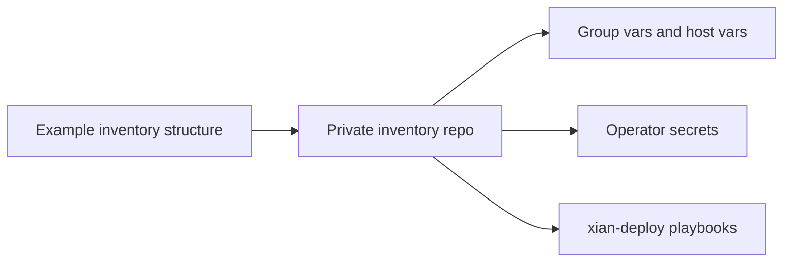

# Inventories

## Purpose
- This folder contains example inventory structure for `xian-deploy`.

## Notes
- Keep real inventories and secrets out of the public repo.
- Use this folder as the shape reference for private deployment repos.
- The `example/solutions/` subfolder shows the recommended host layouts for
  the validated remote starter flows.

