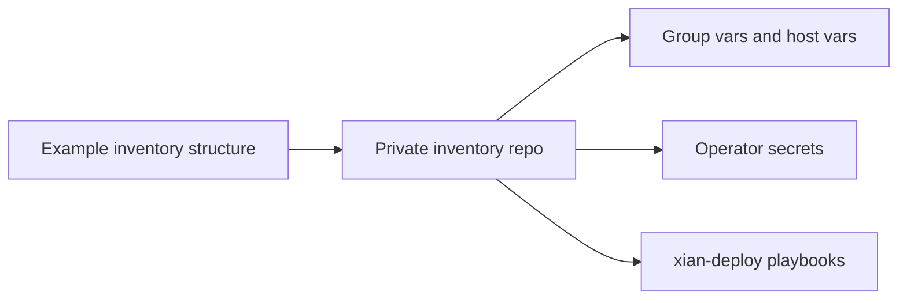

# Inventories

## Purpose
- This folder contains example inventory structure for `xian-deploy`.

## Notes
- Keep real inventories and secrets out of the public repo.
- Use this folder as the shape reference for private deployment repos.
- Set `xian_deploy_root` for the common remote layout. The deployment roles
  derive runtime, node-home, BDS, and monitoring paths from that root; override
  individual path vars only when a host needs a non-standard layout.
- The `example/examples/` subfolder shows reusable host layouts for generated
  node profiles.

