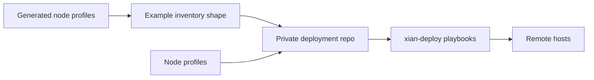

# Example Inventory Shapes

## Purpose
- This folder contains example host layouts for deploying node profiles onto
  remote hosts.

## Files
- `single-node-indexed-hosts.yml`: one BDS-backed node on one host.
- `consortium-5-hosts.yml`: five validator profiles on five hosts.

## Notes
- These are only structure references.
- Keep real inventories, host vars, and secrets in a private deployment repo.
- Set `xian_node_profile` per host. The profile carries runtime intent; the
  inventory carries deploy bindings and secrets.

