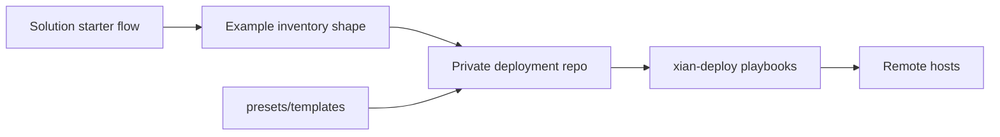

# Solution Inventory Shapes

## Purpose
- This folder contains example host layouts for the remote solution starter flows.

## Files
- `embedded-backend-hosts.yml`: single-host service-node layout used by the Credits Ledger and Workflow Backend remote flows
- `consortium-3-hosts.yml`: three-validator plus service-node layout used by the Registry / Approval and DEX Demo remote flows

## Notes
- These are only structure references.
- Keep real inventories, host vars, and secrets in a private deployment repo.
- Apply runtime presets from `presets/templates/` in host vars or with `-e @...`
  as documented in `docs/SOLUTIONS.md`.

