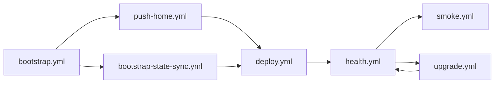

# Playbooks

## Purpose
- This folder contains the operator entrypoints for `xian-deploy`.

## Contents
- `bootstrap.yml`: prepare the host
- `push-home.yml`: upload a prepared node home
- `deploy.yml`: deploy or update the runtime
- `health.yml`: detailed remote runtime, BDS, state-sync, and disk checks
- `upgrade.yml`: serial rollout
- `bootstrap-state-sync.yml`: deploy with validated state-sync settings
- `restore-state-snapshot.yml`: restore an exported state snapshot
- `smoke.yml`: basic post-deploy health check

## Typical Flow
1. `bootstrap.yml`
2. `push-home.yml` or `bootstrap-state-sync.yml`
3. `deploy.yml`
4. `health.yml`
5. `upgrade.yml` for later image rollouts

