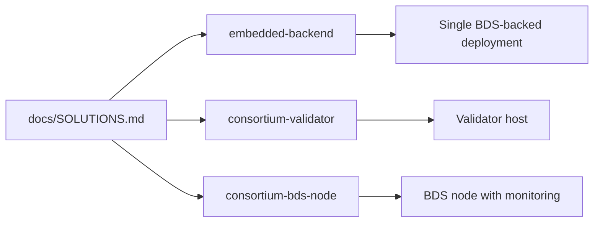

# Template Presets

## Purpose
- This folder contains reusable remote deployment presets that mirror the canonical Xian template classes.

## Presets
- `embedded-backend.yml`: BDS-backed posture for application-oriented remote deployments
- `consortium-validator.yml`: validator posture for shared-state consortium deployments
- `consortium-bds-node.yml`: BDS node posture for consortium deployments with BDS and monitoring

## Usage

Apply one of these presets with:

```bash
ansible-playbook playbooks/deploy.yml -e @presets/templates/embedded-backend.yml
```

Use the solution runbook in `docs/SOLUTIONS.md` to see which preset matches
each reference-app flow.


