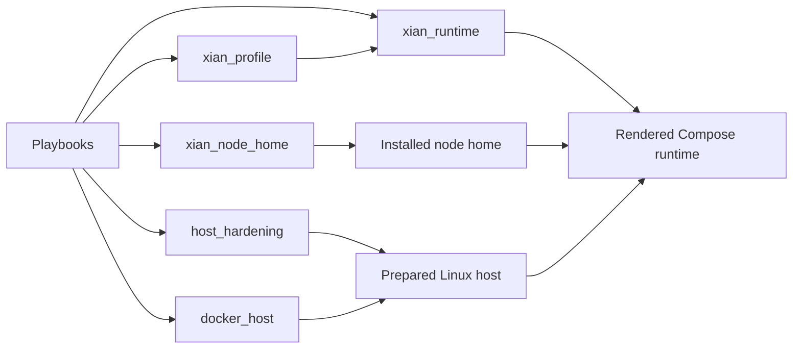

# Roles

## Purpose
- This folder contains the implementation details behind the deployment playbooks.

## Contents
- `host_hardening/`: host sysctl baseline and opt-in SSH/firewall hardening
- `docker_host/`: Docker bootstrap
- `xian_profile/`: node profile loading and runtime fact derivation
- `xian_node_home/`: prepared home upload and extraction
- `xian_runtime/`: runtime rendering, remote configuration, and Compose operations

